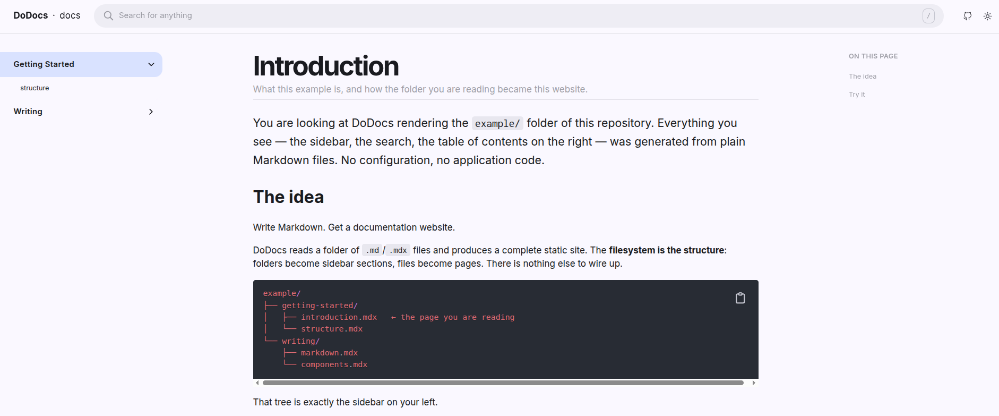

<div align="center">
  
  <h1 align="center">DoDocs</h1>
  <p align="center">
    Transforme arquivos Markdown em um site de documentação.<br>
    <a href="https://thiagocajadev.github.io/do-docs/getting-started/introduction">Acesse a documentação online</a>
    ·
    <a href="README.md">Read in English</a>
  </p>
  <a href="https://github.com/thiagocajadev/do-docs/releases"></a>
  <a href="https://github.com/thiagocajadev/do-docs/pkgs/container/do-docs"></a>
  <a href="https://nodejs.org"></a>
  <a href="LICENSE"></a>
</div>

<br>

Você entrega ao DoDocs uma pasta com arquivos Markdown. Ele devolve um site estático com navegação lateral, busca, sumário, destaque de sintaxe, temas claro e escuro, e links de anterior e próximo. Você não escreve nenhuma linha de código de aplicação.

A estrutura das pastas define a estrutura do site. Pastas viram seções da barra lateral e arquivos viram páginas. Sua documentação continua sendo Markdown puro, versionada no mesmo repositório do código.

<p align="center">
  <kbd></kbd>
</p>

<p align="center">
  <sub>A pasta <code>example/</code> deste repositório, renderizada. Rode <code>pnpm dev</code> para chegar nisso. A interface aparece em inglês porque esse é o padrão; com <code>locale: pt-BR</code> ela fica em português.</sub>
</p>

---

## Referência rápida

Não há nada para instalar. Você adiciona uma GitHub Action ao seu repositório, aponta ela para a sua pasta de documentação, e ela publica o site no GitHub Pages.

Crie o arquivo `.github/workflows/docs.yml`:

```yaml
name: Docs

on:
  push:
    branches: ['main']
  workflow_dispatch:

jobs:
  build:
    permissions:
      contents: read
      pages: write
      id-token: write
    uses: thiagocajadev/do-docs/.github/workflows/build.yml@main
    with:
      mdx: 'docs' # sua pasta de Markdown
      libname: 'Meu Projeto' # nome exibido no cabeçalho
      home_redirect: '/getting-started/introduction'
      locale: 'pt-BR' # 'en' (padrão) ou 'pt-BR'
      icon: '📘'

  deploy:
    needs: build
    runs-on: ubuntu-latest
    permissions:
      pages: write
      id-token: write
    environment:
      name: github-pages
      url: ${{ steps.deployment.outputs.page_url }}
    steps:
      - id: deployment
        uses: actions/deploy-pages@v4
```

Faça push na `main`. A Action constrói a sua pasta `docs/` e publica o resultado.

Para ver o site na sua máquina antes de configurar a Action, rode:

```sh
$ curl -sL https://raw.githubusercontent.com/thiagocajadev/do-docs/refs/heads/main/preview.sh | \
  MDX="docs" \
  ICON="🥑" \
  DOCKER_IMAGE="ghcr.io/thiagocajadev/do-docs:latest" \
  sh
```

Isso roda o mesmo build dentro do Docker. Nada é instalado na sua máquina.

---

## `.md` ou `.mdx`?

O DoDocs aceita os dois, na mesma pasta, misturados à vontade. A extensão decide o que o arquivo pode fazer.

| Extensão | Use quando                                | O que você ganha                                                       |
| -------- | ----------------------------------------- | ---------------------------------------------------------------------- |
| `.md`    | Markdown comum, é o caso da maioria       | Todo o Markdown padrão, mais HTML cru como `<details>`                 |
| `.mdx`   | Você quer componentes dentro da página     | Tudo do `.md`, mais componentes como `<Intro>`, `<Hint>` e `<Mermaid>` |

Se você não sabe qual escolher, use `.md`. Renomeie para `.mdx` no dia em que precisar de um componente.

Uma diferença prática: em `.md`, escrever `<div>` produz uma `div` de verdade. Em `.mdx`, uma tag maiúscula como `<Intro>` é lida como componente, então HTML cru precisa ser Markdown válido para JSX.

## O que você recebe

- **Navegação montada a partir das suas pastas.** Pastas viram seções, arquivos viram páginas. A ordem, o agrupamento e os nomes exibidos podem ser ajustados com `nav_order` e `nav_labels`, mas são opcionais.
- **Busca** em todas as páginas, rodando no navegador. Não há serviço de busca para hospedar.
- **Temas** gerados a partir de uma única cor de destaque, com alternância entre claro, escuro e sistema.
- **Blocos de código** com destaque de sintaxe, além de um botão de copiar para a área de transferência.
- **Interface em inglês ou português.** Seu conteúdo nunca é traduzido.
- **Saída estática**, que você publica no GitHub Pages, na Vercel ou em qualquer host estático.

## Configuração

Toda opção da [referência de configuração](docs/getting-started/introduction.mdx#Configuration) pode ser passada como entrada da Action (em minúsculas) ou como variável de ambiente (em maiúsculas).

As mais usadas. As três marcadas com `*` são obrigatórias:

| Entrada           | Variável de ambiente             | O que faz                                        |
| ----------------- | -------------------------------- | ------------------------------------------------ |
| `mdx`\*           | `MDX`                            | Caminho da sua pasta de Markdown                 |
| `libname`\*       | `NEXT_PUBLIC_LIBNAME`            | Nome exibido no cabeçalho                        |
| `home_redirect`\* | `HOME_REDIRECT`                  | Página para onde a `/` redireciona               |
| `locale`          | `NEXT_PUBLIC_LOCALE`             | Idioma da interface: `en` ou `pt-BR`             |
| `nav_order`       | `NAV_ORDER`                      | Ordem da barra lateral, com agrupamento opcional |
| `nav_labels`      | `NAV_LABELS`                     | Nomes que a capitalização automática não acerta  |
| `icon`            | `ICON`                           | Emoji ou imagem usada como favicon               |
| `theme_primary`   | `THEME_PRIMARY`                  | Cor de destaque da qual o tema é gerado          |
| `static_page_generation_timeout` | `STATIC_PAGE_GENERATION_TIMEOUT` | Segundos por página. Aumente para bases grandes |

## Idioma

`locale` define o idioma da interface do DoDocs: a caixa de busca, o título "Nesta Página", os rótulos de anterior e próximo, o alternador de tema e o rodapé. Os valores aceitos são `en` (padrão) e `pt-BR`. Um valor desconhecido cai para o inglês, em vez de quebrar o build.

Isso não afeta o seu Markdown. O DoDocs renderiza o seu conteúdo no idioma em que você escreveu.

## Desenvolvimento

O repositório inclui uma pasta `example/`, para que um clone novo já suba um site funcionando. Use ela para validar o layout antes de apontar o DoDocs para conteúdo real.

```sh
$ pnpm install
$ pnpm dev
```

Abra `http://localhost:3000`. As configurações padrão vêm do `.env.development`, que é versionado no repositório.

Para usar a sua própria pasta:

```sh
$ MDX=./minha-doc pnpm dev
```

Você também pode sobrescrever qualquer configuração no `.env.local`, que é ignorado pelo git e tem precedência sobre o `.env.development`.

## Testes

```sh
$ pnpm test
```

Testes unitários, rodados pelo Vitest, cobrindo as partes que transformam Markdown em páginas: compilação do MDX, reescrita de links e resolução de URLs de imagem. O CI roda eles a cada push.

## Releases

Uma release é feita aumentando o `version` no `package.json`. O CI detecta a mudança, publica a imagem Docker em `ghcr.io/thiagocajadev/do-docs` e cria as tags `v<major>` e `v<major>.<minor>.<patch>`.

## Créditos

O DoDocs é um projeto independente, baseado no trabalho de [pmndrs/docs](https://github.com/pmndrs/docs) do [Poimandres](https://pmnd.rs), o gerador de documentação do qual ele nasceu. Aquele código é licenciado sob MIT, e sua licença e copyright estão preservados em [LICENSE](LICENSE).

Desenvolvido por [@thiagocajadev](https://github.com/thiagocajadev).
